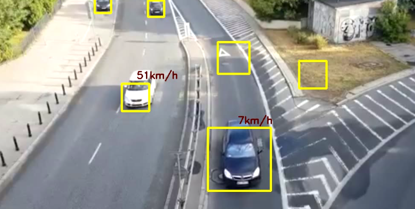

[](https://github.com/Bishwajit-Shil/Car-Speed-Detector/blob/main/outTraffic.avi)


# Traffic Speed Estimation

This project utilizes OpenCV and Dlib libraries to estimate the speed of vehicles in a traffic video. It employs object detection and tracking techniques to monitor vehicle movements and calculate their speeds.

## Getting Started

These instructions will get you a copy of the project up and running on your local machine for development and testing purposes.

### Prerequisites

- Python 3.x
- OpenCV
- Dlib
- `vech.xml` (Classifier File)
- `carsVideo.mp4` (Sample Video File)

### Installation

1. Clone the repository:

   ```bash
   git clone https://github.com/your-username/traffic-speed-estimation.git
   ```

2. Install dependencies:

   ```bash
   pip install opencv-python dlib
   ```

### Usage

1. Place the `vech.xml` classifier file in the project directory.
2. Place the `carsVideo.mp4` video file in the project directory.
3. Run the script:

   ```bash
   python traffic_speed_estimation.py
   ```

## Functionality

- **Object Detection and Tracking**: Utilizes the Cascade Classifier from OpenCV to detect vehicles and Dlib's correlation tracker for tracking.
- **Speed Estimation**: Estimates the speed of vehicles based on their movement between consecutive frames.
- **Output**: Generates an output video `outTraffic.avi` with tracked vehicles and their estimated speeds.

